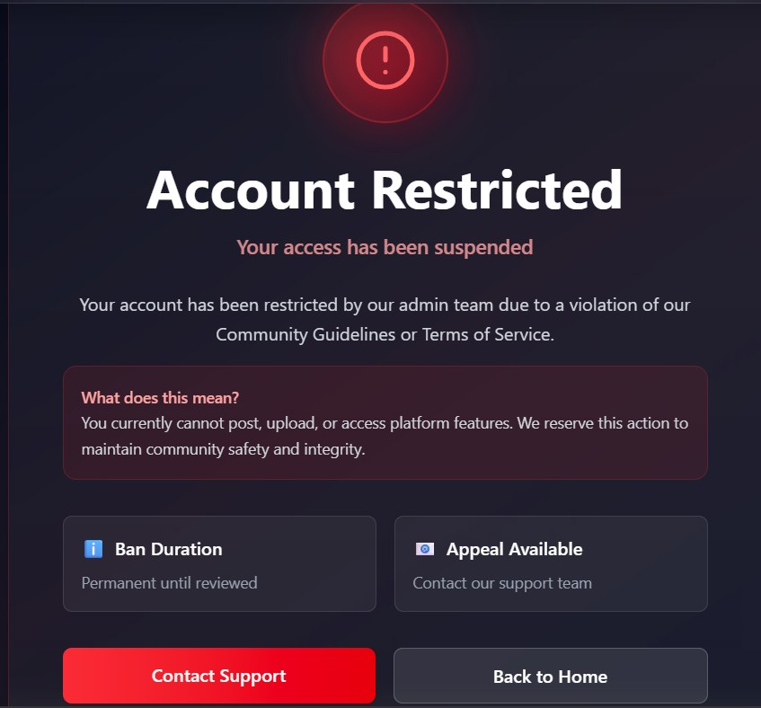
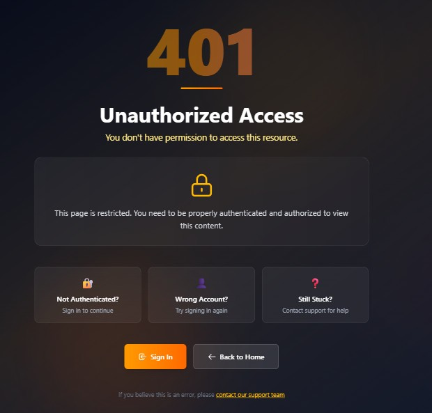
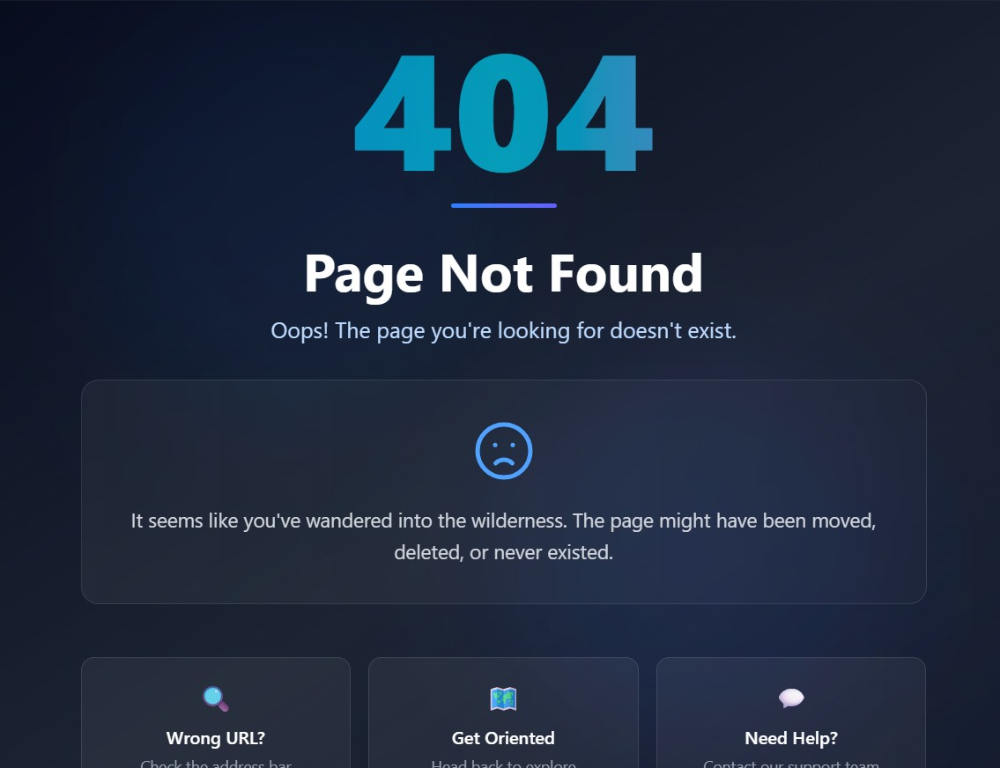

# LifeSpark

LifeSpark is a modern learning platform built with React, Vite, Firebase, and Tailwind CSS. It provides a polished public experience for browsing lessons, a protected user dashboard for managing content and favorites, and an admin area for moderation and oversight.

# Overview

The application is designed as a full-featured educational marketplace where learners can discover lessons, view detailed lesson pages, interact through comments, and access premium pricing flows. Authenticated users get access to their personal dashboard, while admins can manage users, lessons, and reports from a dedicated control panel.

## 🌐 Live Website

[Client Demo](https://life-spark-1b54e.web.app)
[Server Demo](https://life-spark-server.vercel.app/)


## 📸 Screenshot

### 🔐 Login Page
Users can securely log into their accounts using email and password authentication or Login instantly using their Google account.
### 📝 Registration Page
New users can create an account by providing their basic information and credentials or sign up instantly using their Google account.

<p align="center">
  
  
</p>

### Home Page
হোম পেজটি ব্যবহারকারীদের জন্য একটি আকর্ষণীয় ও ইন্টারঅ্যাকটিভ অভিজ্ঞতা প্রদান করে। শুরুতেই রয়েছে Cursor effect ব্যবহার করে তৈরি করা একটি আধুনিক ও animated banner section, যা ওয়েবসাইটটিকে আরও প্রাণবন্ত ও দৃষ্টিনন্দন করে তোলে।

এরপর রয়েছে **Featured Lessons** সেকশন, যেখানে অ্যাডমিন গুরুত্বপূর্ণ ও মানসম্মত লেসনগুলো নির্বাচন করে প্রদর্শন করতে পারেন। ব্যবহারকারীরা এখান থেকে সহজেই গুরুত্বপূর্ণ লেসনগুলো খুঁজে পেতে পারে।

হোম পেজে আরও রয়েছে **Top Contributors of the Week** সেকশন, যা swiper slider ব্যবহার করে তৈরি করা হয়েছে। এখানে সপ্তাহের সেরা ও সবচেয়ে সক্রিয় কন্ট্রিবিউটরদের প্রদর্শন করা হয়।

এছাড়াও ব্যবহারকারীরা **Most Saved Lessons** সেকশনের মাধ্যমে সবচেয়ে বেশি save করা জনপ্রিয় লেসনগুলো দেখতে পারে, যা নতুন ও গুরুত্বপূর্ণ কনটেন্ট খুঁজে পেতে সাহায্য করে।

সবশেষে রয়েছে একটি সুন্দর ও তথ্যবহুল footer section, যেখানে প্রয়োজনীয় লিংক, রিসোর্স এবং অতিরিক্ত তথ্য যুক্ত করা হয়েছে যাতে ব্যবহারকারীরা সহজে প্রয়োজনীয় তথ্য খুঁজে পেতে পারে।
<p align="center">
  
  
  
</p>

# public Lesson page
পাবলিক লেসন পেজটি এমনভাবে তৈরি করা হয়েছে যাতে লগইন ছাড়া যেকোনো ব্যবহারকারীও লেসনগুলো দেখতে পারে। ব্যবহারকারীরা সহজেই বিভিন্ন লেসন ব্রাউজ করতে এবং প্রয়োজন অনুযায়ী খুঁজে নিতে পারে।
এই পেজে রয়েছে powerful search functionality, যার মাধ্যমে ব্যবহারকারীরা lesson title, category এবং emotion অনুযায়ী লেসন সার্চ করতে পারে। ফলে নিজের আগ্রহ ও প্রয়োজন অনুযায়ী কনটেন্ট খুঁজে পাওয়া আরও সহজ হয়।
প্রতিটি lesson card এ lesson related গুরুত্বপূর্ণ তথ্য যেমন lesson creator এর নাম, publish date, likes এবং অন্যান্য তথ্য প্রদর্শন করা হয়, যাতে ব্যবহারকারীরা লেসন সম্পর্কে দ্রুত ধারণা নিতে পারে।
তবে শুধুমাত্র লগইন করা ব্যবহারকারীরাই lesson details page এ প্রবেশ করতে পারবে। যদি কোনো ব্যবহারকারী লগইন ছাড়া details page এ যেতে চায়, তাহলে তাকে প্রথমে authentication সম্পন্ন করতে হবে।


## ⚙️ Admin Dashboard

অ্যাডমিন ড্যাশবোর্ডটি ওয়েবসাইটের সকল গুরুত্বপূর্ণ তথ্য ও কার্যক্রম সহজভাবে মনিটর করার জন্য তৈরি করা হয়েছে। এখানে অ্যাডমিন খুব সহজেই প্ল্যাটফর্মের overall activity এবং statistics দেখতে পারে।
ড্যাশবোর্ডে মোট users সংখ্যা, total public lessons, reported lessons এবং আজকে তৈরি হওয়া lessons এর তথ্য প্রদর্শন করা হয়, যা অ্যাডমিনকে প্ল্যাটফর্মের বর্তমান অবস্থা সম্পর্কে দ্রুত ধারণা দেয়।
এছাড়াও lesson growth এবং user growth এর তথ্য visually উপস্থাপন করার জন্য bar chart ব্যবহার করা হয়েছে। এর মাধ্যমে সময়ের সাথে সাথে platform এর growth সহজেই বিশ্লেষণ করা যায়।
ড্যাশবোর্ডে আরও রয়েছে **Most Active Contributor** সেকশন, যেখানে সবচেয়ে বেশি active এবং valuable contribution করা user দের highlight করা হয়। এটি community engagement বাড়াতে গুরুত্বপূর্ণ ভূমিকা রাখে।


## 👥 Manage Users Page

Manage Users পেজের মাধ্যমে অ্যাডমিন খুব সহজেই সকল ব্যবহারকারীকে পরিচালনা ও নিয়ন্ত্রণ করতে পারে। এই পেজে platform এর সকল users এর তালিকা প্রদর্শন করা হয় এবং প্রয়োজনীয় management features প্রদান করা হয়েছে।
অ্যাডমিন user search functionality ব্যবহার করে দ্রুত নির্দিষ্ট কোনো user খুঁজে বের করতে পারে। এছাড়াও এখানে total users, মোট কতজন admin রয়েছে এবং কতজন banned user আছে তার পরিসংখ্যানও দেখানো হয়।
প্রতিটি user এর জন্য অ্যাডমিন বিভিন্ন ধরনের action নিতে পারে। যেমন:
- সাধারণ user কে admin হিসেবে promote করা
- কোনো user কে ban অথবা unban করা
- প্রয়োজন হলে কোনো user কে permanently delete করা

এই page টি platform এর security, moderation এবং user management সহজ ও কার্যকরভাবে পরিচালনা করতে সাহায্য করে।


## 📖 Manage Lessons Page

Manage Lessons পেজের মাধ্যমে অ্যাডমিন প্ল্যাটফর্মের সকল lessons সহজেই পর্যবেক্ষণ ও নিয়ন্ত্রণ করতে পারে। এখানে admin public এবং private উভয় ধরনের lesson দেখতে পারে এবং lesson সম্পর্কিত বিভিন্ন management action পরিচালনা করতে পারে।

অ্যাডমিন reported lessons গুলোও আলাদাভাবে দেখতে পারে, যার মাধ্যমে inappropriate বা সমস্যাযুক্ত content দ্রুত review করা সম্ভব হয়।

এই page থেকে admin কোনো lesson কে featured হিসেবে যুক্ত করতে পারে, যাতে সেটি homepage এ প্রদর্শিত হয়। প্রয়োজন হলে featured lesson আবার remove ও করা যায়।

এছাড়াও অ্যাডমিন প্রতিটি lesson review করতে পারে এবং platform policy অনুযায়ী প্রয়োজন হলে lesson permanently delete করার সুবিধাও রয়েছে। এই feature গুলো platform এর quality, security এবং content management বজায় রাখতে গুরুত্বপূর্ণ ভূমিকা পালন করে।


## 🚨 Reported Lessons Page

Reported Lessons পেজের মাধ্যমে অ্যাডমিন সকল reported lesson সহজেই পর্যবেক্ষণ করতে পারে। কোনো user যদি কোনো lesson এর বিরুদ্ধে report করে, তাহলে সেই lesson এই page এ প্রদর্শিত হয়।

অ্যাডমিন প্রতিটি report এর reason বিস্তারিতভাবে দেখতে পারে, যার মাধ্যমে সমস্যার কারণ দ্রুত বোঝা সম্ভব হয়।

এই page থেকে admin প্রয়োজন অনুযায়ী report ignore করতে পারে যদি report টি invalid বা অপ্রয়োজনীয় হয়। এছাড়াও যদি lesson টি platform policy ভঙ্গ করে, তাহলে admin সেই lesson permanently delete করার সুবিধা পায়।

এই feature টি platform এর content quality, security এবং community guidelines বজায় রাখতে গুরুত্বপূর্ণ ভূমিকা পালন করে।


##  Admin Profile Page

Admin Profile পেজে অ্যাডমিনের ব্যক্তিগত তথ্য এবং platform এ তার সকল গুরুত্বপূর্ণ activity প্রদর্শন করা হয়। এই page এর মাধ্যমে admin নিজের পরিচালিত actions এবং moderation history সহজেই পর্যবেক্ষণ করতে পারে।

এখানে admin এর বিভিন্ন কার্যক্রম যেমন:
- কোনো user কে ban করা
- ban remove করা
- lesson review করা
- lesson delete করা
- report ignore করা
- নতুন admin তৈরি করা

ইত্যাদি activity timeline আকারে দেখানো হয়।

এছাড়াও কোনো action নেওয়ার ক্ষেত্রে reason বা related information ও প্রদর্শিত হতে পারে, যা platform management কে আরও transparent এবং organized করে তোলে।
এই page টি admin এর overall activity tracking এবং moderation history সংরক্ষণে গুরুত্বপূর্ণ ভূমিকা পালন করে।


## ❤️ Favorite Lessons Page

Favorite Lessons পেজে ব্যবহারকারীরা তাদের save করা সকল lessons একসাথে দেখতে পারে। এই page এর মাধ্যমে user সহজেই নিজের পছন্দের ও গুরুত্বপূর্ণ lessons পরবর্তীতে আবার access করতে পারে।
প্রতিটি saved lesson card এ lesson সম্পর্কিত প্রয়োজনীয় তথ্য প্রদর্শন করা হয়, যাতে ব্যবহারকারীরা দ্রুত lesson সম্পর্কে ধারণা নিতে পারে।
এছাড়াও user চাইলে যেকোনো saved lesson favorite list থেকে remove অথবা delete করতে পারে। এই feature টি গুরুত্বপূর্ণ lessons সংরক্ষণ এবং সহজে পুনরায় খুঁজে পাওয়ার জন্য অনেক কার্যকর।


## 📚 My Lessons Page

My Lessons পেজের মাধ্যমে ব্যবহারকারীরা তাদের নিজস্ব তৈরি করা সকল lessons একসাথে দেখতে এবং পরিচালনা করতে পারে। এই page টি user এর personal lesson management সহজ ও কার্যকরভাবে করার জন্য তৈরি করা হয়েছে।

এখানে user তার তৈরি করা প্রতিটি lesson এর details দেখতে পারে এবং প্রয়োজন অনুযায়ী lesson update বা edit করার সুবিধা পায়।

এছাড়াও ব্যবহারকারীরা চাইলে:
- lesson delete করতে পারে
- lesson এর access control পরিবর্তন করতে পারে
- free lesson কে premium অথবা premium lesson কে free করতে পারে
- lesson কে public বা private হিসেবে সেট করতে পারে

এই feature গুলো ব্যবহারকারীদের তাদের content সম্পূর্ণভাবে নিয়ন্ত্রণ এবং manage করার সুবিধা প্রদান করে।


##  Add Lesson Page

Add Lesson পেজের মাধ্যমে ব্যবহারকারীরা খুব সহজেই নতুন lesson তৈরি ও publish করতে পারে। এখানে user প্রয়োজনীয় lesson information প্রদান করে নিজের educational content platform এ যুক্ত করতে পারে।

Lesson তৈরি করার সময় ব্যবহারকারীরা lesson title, description, category, emotion, thumbnail, content এবং অন্যান্য প্রয়োজনীয় তথ্য যোগ করতে পারে।

এছাড়াও user lesson এর access type নির্বাচন করতে পারে, যেমন:
- Free বা Premium
- Public বা Private

এই page টি এমনভাবে ডিজাইন করা হয়েছে যাতে ব্যবহারকারীরা সহজ ও user-friendly interface এর মাধ্যমে দ্রুত এবং কার্যকরভাবে নতুন lesson তৈরি করতে পারে।


## 👤 User Profile Page

User Profile পেজে ব্যবহারকারীর ব্যক্তিগত তথ্য এবং platform এ তার activity সম্পর্কিত গুরুত্বপূর্ণ তথ্য প্রদর্শন করা হয়। এখানে user এর নাম, email এবং profile related information দেখা যায়।
এছাড়াও এই page এ ব্যবহারকারীর তৈরি করা মোট lessons সংখ্যা প্রদর্শন করা হয়, যার মধ্যে কতগুলো public, কতগুলো private এবং কতগুলো reported lesson রয়েছে তাও আলাদাভাবে দেখানো হয়।
এই feature এর মাধ্যমে ব্যবহারকারীরা খুব সহজেই তাদের নিজের content এবং activity সম্পর্কে পরিষ্কার ধারণা পেতে পারে।


# other page

প্ল্যাটফর্মে নিরাপত্তা ও সঠিক access control নিশ্চিত করার জন্য বিভিন্ন ধরনের protected page যুক্ত করা হয়েছে।

যদি কোনো banned user লগইন করার চেষ্টা করে, তাহলে তাকে সরাসরি **Ban Page** এ redirect করা হবে এবং সে ওয়েবসাইটের কোনো feature access করতে পারবে না।

এছাড়াও কোনো সাধারণ user যদি admin-only page access করার চেষ্টা করে, তাহলে তাকে **Unauthorized Page** এ নিয়ে যাওয়া হবে। এর মাধ্যমে restricted page গুলোতে অননুমোদিত access সম্পূর্ণভাবে নিয়ন্ত্রণ করা হয়।

আর যদি কোনো ব্যবহারকারী ভুল বা অস্তিত্বহীন route/page এ প্রবেশ করে, তাহলে তাকে একটি সুন্দর ও user-friendly **404 Not Found Page** এ redirect করা হবে, যাতে ব্যবহারকারী বুঝতে পারে যে requested page টি পাওয়া যায়নি।





---

## ✨ Main Features

* 🔐 Firebase Authentication
* 👑 Admin Dashboard
* 📚 Create & Manage Lessons
* ❤️ Favorite Lessons System
* 🚫 Ban / Unban Users
* 🗑️ Delete Users & Lessons
* 💳 Stripe Payment Integration
* 📱 Fully Responsive Design
* ⚡ Modern Dashboard UI
* 🔎 Search & Filter Users
* 🛡️ JWT / Firebase Token Security

---

## 👑 Admin Features

* Manage all users
* Make admin
* Ban / Unban users
* Delete users
* Manage lessons
* View reports
* Track admin activities

---

## 👤 User Features

* Add lessons
* Update lessons
* Delete lessons
* Save favorite lessons
* View lesson details
* Comment on lessons

---

## 🛠️ Technologies Used

### Frontend

* React
* React Router
* Tailwind CSS
* DaisyUI
* React Query
* Axios
* Firebase
* SweetAlert2
* Lucide React

### Backend

* Node.js
* Express.js
* MongoDB
* Firebase Admin SDK
* JWT Authentication

---

## 📦 NPM Packages

### Client

```bash
npm install react-router @tanstack/react-query axios firebase sweetalert2 lucide-react react-icons
```

### Server

```bash
npm install express mongodb cors dotenv firebase-admin stripe
```

---

## ⚙️ Environment Variables

### Client

```env
VITE_apiKey=
VITE_authDomain=
VITE_projectId=
VITE_storageBucket=
VITE_messagingSenderId=
VITE_appId=
```

### Server

```env
DB_USER=
DB_PASSWORD=
STRIPE_SECRET_KEY=
FB_SERVICE_KEY=
SITE_DOMAIN=
```

---

## 💻 Run Locally

### Client

```bash
npm install
npm run dev
```

### Server

```bash
npm install
nodemon index.js
```

---

## 🔒 Authentication

* Firebase Authentication
* Firebase Admin Token Verification
* Protected Routes
* Admin Protected Routes

---


## 👨‍💻 Developer

Developed with ❤️ by Sohag Ali

